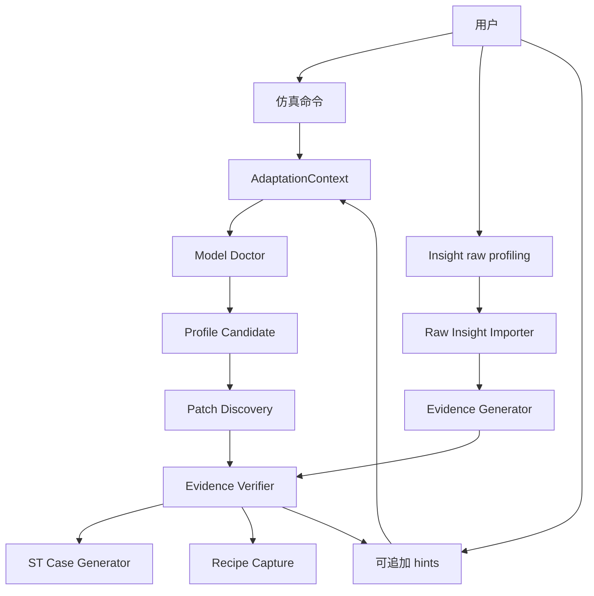

# TensorCast 新模型接入效率提升最终设计

文档状态：最终开发指导稿。

本文件是后续开发、评审和验收的共同依据。若实现中发现设计需要调整，应先更新本文档中的流程契约、CLI 契约、report schema 或验收标准，再改代码和测试。

## 1. 文档目的

本文档用于指导 TensorCast 新模型接入效率提升功能的开发。目标不是只支持某一个新模型，而是建立一套可以持续复用的模型接入流程，使 AI 和开发者能够在最少人工输入下完成模型结构识别、`ModelProfile` 编写、运行补丁发现、profiling evidence 生成、验证和回归防护。

本设计基于以下原则：

- 用户必须提供的输入只有两项：MindStudio Insight raw profiling 导出文件，以及与该 profiling 对应的 TensorCast 仿真命令。
- 其他信息均为可选补充。系统必须假设最差情况下用户无法提供软件版本、源码分析、算子对应关系、shape 明细等信息。
- 模型适配是迭代过程。用户可以在任意阶段补充刚刚确认的信息，例如某个仿真算子名、调用次数、可能的 shape、或某个 profiling kernel 与仿真算子的疑似对应关系。
- 确定性程序优先。AI 只负责确定性程序无法完成的推理、源码语义分析和补丁草案生成，且 AI 输出必须被 doctor、dry-run、evidence verifier、ST case 等确定性门禁验证。
- 正常适配流程应参考已有模型适配、同族 profile、recipe 和历史 patch。只有 replay/audit 测试才屏蔽被测模型的既有 profile，避免循环论证。

## 2. 开发环境要求

开发和验证命令建议在 Linux/WSL 终端中执行，并使用项目配置的 Python 环境。

如果需要新分支开发，建议从 `develop` 新建分支，已有适配分支只作为参考材料：

```bash
git fetch origin
git checkout develop
git pull --ff-only
git checkout -b <branch-name>
```

开发期间优先运行聚焦测试：

```bash
pytest tests/regression/tensor_cast/test_adapter_automation.py -q
pytest tests/test_tensor_cast -k "adapter or doctor or evidence or qwen3_vl" -q
```

如果改动涉及 ST case 生成或实际模型路径，还需要运行对应的 smoke/ST 验证。

## 3. 核心问题

新模型接入困难主要来自以下几类问题：

| 问题 | 现象 | 需要的能力 |
| --- | --- | --- |
| 模型结构未知 | 不知道 attention、MoE、MLA、MTP、VL 模块在哪里 | structure doctor |
| profile 字段不确定 | 不知道 `moe_module_name`、expert key、VL path、linear mapping 如何填写 | profile candidate + validation |
| 运行补丁缺失 | meta tensor、compile、boolean mask、`nonzero`、placeholder 校验导致仿真失败 | patch discovery doctor |
| profiling 难解释 | 用户只有 Insight raw profiling，不知道真实算子与仿真算子对应关系 | raw Insight importer + AI op mapping |
| 适配过程不可追踪 | 反复试错，缺少阶段产物和检查点 | adaptation context + reports |
| 回归保护不足 | 模型跑通后缺少自动生成的精度/性能防护网 | evidence + ST case generator |

## 4. 总体架构



四类能力边界：

| 能力 | 职责 | 不负责 |
| --- | --- | --- |
| Command/Context | 解析仿真命令，固定模型、硬件、并行、量化、compile、输入规模 | 推断用户没有给出的真实 workload |
| Doctor | 扫描模型结构，生成 profile 候选，执行 dry-run，分类失败 | 直接相信 AI 推理 |
| Evidence | 从 raw profiling 和 actual summary 生成、验证关键算子证据 | 要求人类手写完整 evidence |
| AI Skill/Prompt | 处理源码语义、复杂算子映射、patch 草案 | 绕过确定性验证 |

## 5. 输入契约

### 5.1 必需输入

用户必须提供：

1. MindStudio Insight raw profiling 导出文件。
2. 该 profiling 对应的 TensorCast 仿真命令。

Raw profiling 导出文件必须包含标题后的第一行 `Totals`。该行的
`Wall Duration(ms)` 表示实测 forward 总耗时，对应仿真结果中的 analytic
total time，是判断模型接入是否完成的重要证据。若 total forward time
差异很大，应优先认为适配仍失败，需要继续检查 profile、patch、op mapping
或性能数据库覆盖。

最小格式示例：

```text
Name    Wall Duration(ms)    Self Time(ms)    Average Wall Duration(ms)    Max Wall Duration(ms)    Min Wall Duration(ms)    Occurrences
Totals  22.328398            22.328398        0.005782                     0.238545                 0.000000                 3862
FusedInferAttentionScore_*    3.055183         3.055183                    0.049277                 0.068602                 0.043541                 62
```

示例：

```bash
python -m cli.inference.text_generate MiniMaxAI/MiniMax-M2.7 \
  --device ATLAS_800_A3_560T_128G_DIE \
  --num-devices 16 \
  --num-queries 24 \
  --query-length 1 \
  --context-length 3900 \
  --compile \
  --quantize-attention-action DISABLED \
  --tp-size 8 \
  --ep-size 16 \
  --dump-input-shapes \
  --quantize-linear-action W8A8_STATIC
```

命令解析后必须保留原始命令文本，后续所有 report 都要引用该命令，避免 evidence 与仿真配置不一致。

### 5.2 可追加 hints

适配过程中，用户可以随时补充 hints。hints 是增量信息，不要求一次填全。

建议格式：

```yaml
version: 1
model_id: MiniMaxAI/MiniMax-M2.7
hints:
  - kind: profiling_op_observation
    op: DispatchFFNCombine
    count: 62
    confidence: medium
    note: "用户认为这是 MoE FFN 融合算子"

  - kind: tc_op_observation
    op: tensor_cast.attention.default
    count: 62
    shape_variants:
      - "[24, 1, 3900, 128]"
    confidence: low
    note: "shape 可能只覆盖部分调用点"

  - kind: op_mapping_hint
    profiling_op: FusedInferAttentionScore
    tc_op: tensor_cast.attention.default
    confidence: medium
    note: "从名称和调用次数推测"
```

hints 合并规则：

- 用户 hints 不直接覆盖确定性事实，而是作为带来源的证据进入推理。
- 当 hints 与 raw profiling、actual summary 冲突时，doctor 必须输出冲突项。
- shape hints 可以是不完整的，因为同一算子可能存在多个调用点和多个 shape variant。
- 每次 doctor 输出都应提示哪些 hints 最有助于下一轮适配。

## 6. 标准适配流程

### 6.1 Stage 0: 分支和环境准备

开发者从 `develop` 新建分支，当前参考分支只用于借鉴已有设计和代码。

必须在 Linux/WSL 终端中执行，并使用项目配置的 Python 环境。

### 6.2 Stage 1: 创建 AdaptationContext

新增或扩展 CLI，支持从仿真命令创建上下文：

```bash
python -m cli.inference.model_adapter doctor \
  --from-command-file reports/minimax_m27_command.txt \
  --raw-insight-file raw_profiling_from_insight.txt \
  --output reports/minimax_m27_doctor.json
```

`AdaptationContext` 至少包含：

```yaml
version: 1
model_id: MiniMaxAI/MiniMax-M2.7
raw_command: "python -m cli.inference.text_generate ..."
normalized_args:
  device: ATLAS_800_A3_560T_128G_DIE
  num_devices: 16
  num_queries: 24
  query_length: 1
  context_length: 3900
  compile: true
  tp_size: 8
  ep_size: 16
  quantize_linear_action: W8A8_STATIC
  quantize_attention_action: DISABLED
artifacts:
  raw_insight_file: raw_profiling_from_insight.txt
```

### 6.3 Stage 2: Raw Insight Import

Raw Insight importer 负责把用户导出的表格转成结构化 `ObservedKernelSummary`。

输入列可能包括：

- `Name`
- `Wall Duration(ms)`
- `Self Time(ms)`
- `Average Wall Duration(ms)`
- `Max Wall Duration(ms)`
- `Min Wall Duration(ms)`
- `Occurrences`

解析规则：

- 标题后的第一行必须是 `Totals`，并单独解析为 forward 总耗时，不作为普通 kernel 进入 top operator 列表。
- 保留原始 `Name`。
- 生成归一化 kernel name，例如去除 hash、长数字后缀和性能标签。
- 记录调用次数、总耗时、平均耗时。
- 根据名称做初步分类，例如 attention、MoE、matmul、quant、norm、cast、communication、runtime overhead。

示例推理：

| Profiling kernel | Occurrences | 初步语义 |
| --- | --- | --- |
| `FusedInferAttentionScore_*` | 62 | attention 融合算子 |
| `DispatchFFNCombine_*` | 62 | MoE FFN/dispatch/combine 融合算子 |
| `MoeGatingTopK_*` | 62 | MoE router/top-k |
| `QuantBatchMatmulV3_*` | 124 | W8A8 量化 matmul |
| `DynamicQuant_*` | 124 | activation dynamic quant |

这些事实不要求用户解释，系统应自动使用它们生成 evidence 草案。

### 6.4 Stage 3: Structure Doctor

doctor 加载模型 config 和 meta 模型，扫描：

- `model_type`
- `num_hidden_layers`
- `hidden_size`
- attention-like modules
- MoE-like modules
- MLA-like modules
- MTP-like modules
- VL visual/language module paths
- visual layer path
- visual merger linear mapping
- visual MLP linear mapping
- expert count config key

正常模式应允许参考已有 profile 和 recipe。只有 replay/audit 模式才屏蔽指定模型的既有 profile。

推荐 CLI 语义：

```bash
python -m cli.inference.model_adapter doctor \
  --from-command-file reports/qwen3_vl_command.txt \
  --raw-insight-file reports/qwen3_vl_raw.txt \
  --output reports/qwen3_vl_doctor.json
```

Replay/audit 专用：

```bash
python -m cli.inference.model_adapter doctor \
  --from-command-file reports/qwen3_vl_command.txt \
  --raw-insight-file reports/qwen3_vl_raw.txt \
  --ignore-existing-profile qwen3_vl \
  --ignore-existing-profile qwen3_vl_moe \
  --output reports/qwen3_vl_replay_doctor.json
```

`--ignore-existing-profile` 只能用于验证流程能力，不能作为普通适配默认项。

### 6.5 Stage 4: Profile Candidate

生成 `ProfileCandidate`，每个字段必须带来源和置信度：

```json
{
  "model_type": {
    "value": "qwen3_vl",
    "source": "hf_config.model_type",
    "confidence": "high"
  },
  "visual_module_path": {
    "value": "visual",
    "source": "module_tree_scan",
    "confidence": "medium"
  },
  "patch_method": {
    "value": null,
    "source": "not_determined_before_runtime",
    "confidence": "low",
    "requires_runtime_patch_discovery": true
  }
}
```

Profile 生成原则：

- 普通新模型适配可以直接生成 built-in profile 草案文件，例如 `tensor_cast/transformers/builtin_model/<model_type>.py`。
- doctor CLI 应提供 `--profile-draft-output`，把候选 profile 草案写入指定文件；该文件可以直接作为 built-in 草案进入分支。
- 该文件可以进入分支代码，但只有通过 validation、dry-run、evidence verification 后才算 verified。
- replay/audit 测试中应使用隔离 registry 或禁用被测 profile，避免读取答案。

### 6.6 Stage 5: Profile Validation

确定性校验项：

| 检查项 | 要求 |
| --- | --- |
| `model_type` | 非空，和 config 一致 |
| MoE module | module class 存在，专家 key 可解析 |
| MoE fields | override 只写非默认字段 |
| MLA module | module class 存在，field mapping 合法 |
| VL paths | visual/language/layers path 可达 |
| visual linear mapping | pattern 能命中模块，未命中必须 warning |
| patch method | callable，且不能在 import 时执行高风险副作用 |

失败时输出具体字段和建议，不应只报运行异常。

### 6.7 Stage 6: Dry-run 与 PatchReport

以候选 profile 运行最小 dry-run，记录：

- patch pass 名称
- target module
- matched modules
- replaced modules
- skipped modules
- missing fields
- candidate aliases
- expected replacement count

PatchReport 是关键检查点：

- 发现 MoE-like module 但 MoE patch 未替换，必须阻塞。
- 发现 VL model 但 visual path 不可达，必须阻塞。
- expected replacements 与 layer 数明显不符，必须阻塞或要求用户补充 hints。

### 6.8 Stage 7: Patch Discovery

Patch discovery 用于发现 `ModelProfile` 无法表达的运行时兼容问题。

典型失败类型：

| 分类 | 例子 | 处理方式 |
| --- | --- | --- |
| meta tensor value read | `.item()`、`len(tensor)`、基于 tensor 值分支 | 改为 shape-stable 路径 |
| dynamic shape op | `nonzero`、boolean mask indexing | 绕开数据相关路径或替换为 TensorCast op |
| placeholder strict check | image/video token count 校验 | 在仿真模式跳过严格检查 |
| compile graph break | tensor value branch、unsupported Python control flow | patch 成 compile-friendly 路径 |
| unsupported op routing | HF forward 使用未建模 fused op | route 到 `torch.ops.tensor_cast.*` |
| signature mismatch | forward 参数和 TensorCast wrapper 不一致 | 过滤或补齐参数 |

Patch discovery 流程：

1. 使用候选 profile 运行最小 smoke。
2. 捕获完整 stacktrace、graph break、failed method。
3. 将失败日志传给 `model_adapter doctor --patch-failure-file <failure.log>`，doctor 按失败 taxonomy 分类。
4. doctor 产出 `PATCH_METHOD_AUTHORING` AI task，包含确定性证据、可疑 traceback 位置、约束、验证命令和可直接给 AI 助手的 prompt。
5. 用户或用户的 AI 助手基于 task、失败上下文和 installed transformers 源码生成 patch 草案。
6. patch 草案经过人工 review 后进入 built-in profile 文件。
7. 再次运行 dry-run、smoke、evidence verification。

doctor 是确定性程序，不直接生成模型专属 patch 代码。即使识别到 Qwen3-VL placeholder/mask meta failure，也只生成 AI task 和 reviewed placeholder；具体 patch 方法由用户或用户的 AI 助手基于 installed transformers 源码实现。

`PATCH_METHOD_AUTHORING` task 必须包含：

- task type、标题和摘要。
- 失败日志与 deterministic findings。
- 可疑 traceback 位置。
- 建议的 `patch_method` 名称。
- patch 约束，例如只能修复 TensorCast 仿真路径、不得复制同模型已有 built-in profile。
- 需要 AI 助手输出的内容：class/method、失败原因、代码 diff、保留/绕过的语义、验证命令。
- 可直接复制给 AI 助手的 prompt text。

不允许 AI 仅凭模型名生成 patch。必须引用失败栈、源码方法、仿真目标。

### 6.9 Stage 8: Evidence Generation

Evidence generator 合并四类来源：

- raw Insight observed kernels
- TensorCast actual summary
- 用户 hints
- AI op mapping 推理

输出 evidence YAML：

```yaml
version: 1
model:
  model_id: MiniMaxAI/MiniMax-M2.7
  raw_command: "python -m cli.inference.text_generate ..."
cases:
  - name: minimax-m27-decode-a3-w8a8-tp8-ep16
    input:
      num_queries: 24
      query_length: 1
      context_length: 3900
      device: ATLAS_800_A3_560T_128G_DIE
      num_devices: 16
      tp_size: 8
      ep_size: 16
      quantize_linear_action: W8A8_STATIC
    observed_kernels:
      - name: FusedInferAttentionScore
        count: 62
        total_time_ms: 3.072324
      - name: DispatchFFNCombine
        count: 62
        total_time_ms: 11.148411
    expected:
      major_ops:
        - name: tensor_cast.attention.default
          count: 62
          confidence: medium
          source: raw_insight:FusedInferAttentionScore
        - name: tensor_cast.moe.default
          count: 62
          confidence: medium
          source: raw_insight:DispatchFFNCombine
```

doctor report 中的 `evidence_draft` 是 evidence 主体结构。用户可以通过 `export-evidence` 子命令把它导出成 `verify` 所需的 YAML 文件：

```bash
python -m cli.inference.model_adapter export-evidence \
  --doctor-report reports/model_adapter_doctor.json \
  --output reports/evidence.yaml
```

该命令只做确定性格式转换，不替代人工审阅。导出后仍需要确认 case 名称、输入参数、关键算子映射、置信度、shape hints 和可接受误差。

当 mapping 不确定时，不要阻塞生成 evidence，而是降低 confidence，并输出明确的人类补充模板。

### 6.10 Stage 9: Evidence Verification

Verifier 比较 evidence 与 actual summary：

| 失败类别 | 可能原因 |
| --- | --- |
| `OP_MAPPING_MISSING` | TensorCast op 名不一致，或真实后端融合为 profiling-only kernel |
| `OP_COUNT_MISMATCH` | layer 数、repetition、MTP、MoE wrapper、并行配置不一致 |
| `LATENCY_MODEL_MISMATCH` | profiling mapping、性能数据库、融合策略或硬件 profile 问题 |
| `PROFILING_SHAPE_MISSING` | raw evidence 缺 shape，或 profiling database 未覆盖 |
| `PATCH_SEMANTICS_MISSING` | 运行补丁缺失导致关键 TensorCast wrapper 未生效 |
| `COMMUNICATION_GAP` | TP/DP/EP 引入通信算子但 evidence 未覆盖 |

Verifier 不只是给 PASS/FAIL，还要给下一步动作：

- 修 profile
- 修 patch
- 增加 user hints
- 增加 op mapping
- 接受 fusion gap
- 生成 ST case

### 6.11 Stage 10: ST Case Generator

适配通过后自动生成 ST case，减少人工维护。

生成来源：

- normalized command
- actual summary
- evidence verification report
- top operators
- baseline/initial timing

输出路径示例：

```text
tests/st/cases/qwen3-vl-8b-prefill.json
tests/st/cases/qwen3-vl-8b-decode.json
```

生成规则：

- case name 应包含模型、规模、prefill/decode、关键并行或量化信息。
- user_input 必须来自 normalized command，不能手写猜测。
- operators 使用 actual summary top N。
- tolerance 初始值可以保守，但必须在 report 中说明来源。
- 如果 evidence 仍有 low confidence 关键项，不允许生成 verified ST case，只能生成 draft。

## 7. 人类介入设计

人类介入点必须具体、可操作。

不应该问：

```text
请说明 profiling 中的算子和 TensorCast 算子如何对应。
```

应该问：

```text
doctor 发现 FusedInferAttentionScore 出现 62 次，TensorCast attention 出现 60 次。
如果你刚刚确认过相关信息，可以补充以下任意一项：
1. FusedInferAttentionScore 是否对应 attention。
2. TensorCast attention 预期调用次数。
3. 其中任一调用点的 shape。
如果不知道，可以跳过，doctor 将继续按低置信 evidence 处理。
```

人类补充信息应支持任意阶段追加：

- 初始 intake 后
- profile validation 失败后
- dry-run 替换数量异常后
- patch discovery 失败后
- evidence mismatch 后
- ST case 生成前

## 8. Prompt/Skill 设计

需要新增或沉淀以下 prompt/skill。

### 8.1 Raw Insight Op Mapping Prompt

输入：

- raw Insight normalized kernels
- TensorCast actual summary
- normalized command
- user hints
- known op mapping rules

输出：

- profiling kernel 到 TensorCast semantic op 的候选映射
- count 关系
- confidence
- 需要用户补充的问题
- evidence YAML 片段

关键约束：

- 不得要求用户提供完整映射。
- 对 fused kernel 必须标记 fusion 语义。
- 对通信 kernel 必须结合 `tp_size/dp_size/ep_size/num_devices` 判断。
- 对 shape 不足的 evidence 必须降级 confidence。

### 8.2 AI Assistance Task

输入：

- failed command
- stacktrace
- failed method/class
- installed transformers source snippet
- TensorCast model profile candidate
- simulation goal

输出：

- 结构化 `ai_tasks`
- 每个 task 的 prompt text
- task 类型，例如 `PATCH_METHOD_AUTHORING`、`BUG_FIX_INVESTIGATION`、`UNSUPPORTED_OP_ROUTING`、`EVIDENCE_MAPPING_REVIEW`
- 需要 AI 助手产出的代码 diff、作用域、保留和放弃的语义、验证命令、风险说明

关键约束：

- patch 只能解决仿真路径问题。
- patch 必须尽量保持正常 tensor 行为。
- patch 后必须重新跑 dry-run、smoke、evidence verifier。

### 8.3 ST Case Generator Prompt

输入：

- normalized command
- actual summary
- evidence verification report
- model id

输出：

- `tests/st/cases/*.json`
- case name
- tolerance 建议
- top operators
- draft/verified 状态

关键约束：

- 不能凭空写 user_input。
- user_input 必须来源于 normalized command。
- 如果 verification 未通过，只能生成 draft。

## 9. Qwen3-VL Replay 验证

Qwen3-VL 是必须覆盖的真实验证场景。

测试目标：

- 在不读取既有 `qwen3_vl` profile 和 patch 的条件下，重新完成适配流程。
- 允许参考其他模型族、通用 VL recipe、历史非 qwen3-vl patch。
- 完成后再与既有 qwen3-vl 适配做事后对比。

测试约束：

- replay 模式必须禁用 `qwen3_vl` 和 `qwen3_vl_moe` 的既有 profile。
- replay 过程中不允许把 `tensor_cast/transformers/builtin_model/qwen3_vl.py` 作为输入源码参考。
- installed transformers 的 `modeling_qwen3_vl.py` 可以读取，因为真实新模型适配也会读取模型源码。
- 既有 `qwen3_vl.py` 只能作为最终 oracle，用于判断生成 patch 是否语义等价。
- 单测中应提供 tiny config-only fixture，例如 `tests/assets/model_config/qwen3_vl_tiny/config.json`，用于在不下载权重的情况下通过 installed transformers 源码构建真实 Qwen3-VL module tree。

预期发现：

- `model_type=qwen3_vl` 或 `qwen3_vl_moe`
- VL visual/language/layer path
- visual merger/MLP linear mapping
- MoE fields for `qwen3_vl_moe`
- meta-mode placeholder mask 问题
- deepstack visual mask data-dependent path 问题
- 需要生成 `PATCH_METHOD_AUTHORING` AI task，指导用户或 AI 助手实现语义等价 patch

验收标准：

- replay 生成的 profile 通过 validation。
- dry-run PatchReport 符合预期。
- smoke 能跑通 prefill/decode。
- evidence verification 通过或只剩明确 accepted gap。
- 能生成 qwen3-vl ST case。
- tiny fixture replay 至少要证明 doctor 在 `--ignore-existing-profile qwen3_vl` 下仍能发现 `visual`、`language_model`、`visual.blocks`、visual merger/MLP linear mapping，并能基于 failure log 生成完整的 `PATCH_METHOD_AUTHORING` task。

## 10. 测试设计

### 10.1 单元测试

| 测试 | 内容 |
| --- | --- |
| command parser | 从仿真命令生成 normalized args |
| raw Insight parser | 解析 name/time/count，归一化 kernel 名 |
| hints merge | 合并用户 hints，检测冲突 |
| profile validation | 校验 MoE/MLA/VL/patch 字段 |
| evidence generation | 从 raw kernels 生成低/中/高置信 major_ops |
| verifier classification | 分类 count、mapping、latency、shape、communication 问题 |

### 10.2 集成测试

| 测试 | 内容 |
| --- | --- |
| doctor full report | context + structure + candidate + suggestions |
| dry-run patch report | profile 草案能产生替换报告 |
| patch discovery taxonomy | synthetic meta failure 能分类 |
| evidence with hints | 用户补充 hints 后 verification 结果变化可解释 |
| ST case generator | 从 verified report 生成 case json |

### 10.3 端到端测试

| 测试 | 内容 |
| --- | --- |
| MiniMax raw Insight mapping | 使用 raw Insight 样例和仿真命令生成 evidence 草案 |
| Qwen3-VL blind replay | 屏蔽 qwen3-vl profile，重新发现 profile + patch |
| Existing model replay | 选择已适配 MoE/MLA 模型验证 profile 自动推导 |

## 11. 验收标准

功能验收：

- 用户只提供 raw Insight 文件和对应仿真命令时，doctor 能生成完整报告。
- doctor 能输出 profile candidate、字段来源、置信度、待确认项。
- raw Insight importer 能生成 observed kernel summary。
- evidence generator 能生成 evidence 草案，而不是要求用户手写。
- verifier 能分类失败并给下一步动作。
- patch discovery 能识别至少 qwen3-vl 类 VL meta failure。
- 适配成功后能生成 ST case。

质量验收：

- 新流程不依赖读取被测模型已有 profile 来证明自己有效。
- 正常适配流程可以参考已有 profile 和 recipe。
- AI 输出必须经过确定性门禁。
- 所有 report 必须保留 raw command、raw profiling 文件路径和 hints provenance。
- 所有新增 CLI 都能在项目配置的 Python 环境中运行。

## 12. 开发阶段建议

建议按以下顺序实现：

1. Command parser 与 `AdaptationContext`。
2. Raw Insight parser 与 normalized observed kernels。
3. Hints ledger 与 merge/provenance。
4. Doctor report schema 调整。
5. Profile candidate 增强，支持 VL path 和 `patch_method` 待发现状态。
6. Evidence generator，从 raw profiling 自动生成草案。
7. Evidence verifier 分类增强。
8. Patch discovery taxonomy 和 prompt。
9. Built-in profile 草案生成。
10. ST case generator。
11. Qwen3-VL blind replay 测试。

每一阶段都应先补测试，再接 CLI，最后补文档示例。

## 13. 效率提升保证和边界

这套流程能提升效率的原因不是 AI 一次性知道所有答案，而是把新模型接入拆成可复用、可验证、可补充的固定环节：

| 环节 | 效率来源 | 准确性来源 |
| --- | --- | --- |
| command/context | 用户只给一条真实仿真命令，系统统一解析配置 | 后续 report 全部引用同一 normalized command |
| raw Insight importer | 用户不用手写 evidence | profiling 原始事实保留 source/provenance |
| structure doctor | 自动扫描模型结构和候选字段 | profile validation 检查字段是否真的可达 |
| PatchReport | 不靠人工猜 patch 是否生效 | dry-run 记录命中、替换、跳过和缺失项 |
| evidence generator | 从 raw profiling、actual summary、hints 自动生成草案 | confidence 和 source 显式标注，不确定项不伪装成确定事实 |
| verifier | mismatch 不只报失败，还分类下一步动作 | 失败类型固定，避免每次重新解释问题 |
| ST case generator | 适配成功后自动产出回归防护网 | 只能从 normalized command 和 verified report 生成 verified case |

保证边界：

- 可以保证流程环节确定、输入输出固定、失败分类可追踪。
- 可以保证 AI 生成的 profile、patch、evidence 草案必须经过确定性工具验证。
- 不能保证第一次运行就适配成功，因为新模型源码、transformers 行为、后端融合和 profiling 粒度可能不同。
- 当确定性程序无法推断时，流程必须生成最小的人类补充问题，而不是要求人类一次性解释完整模型。

## 14. 开发落地清单

### 14.1 代码落点

建议按以下文件边界开发：

| 模块 | 建议文件 | 责任 |
| --- | --- | --- |
| CLI 入口 | `cli/inference/model_adapter.py` | doctor、verify、context、raw insight、hints、report |
| 仿真命令解析 | `tensor_cast/adapter/context.py` | 从 text_generate 命令生成 `AdaptationContext` |
| Insight 解析 | `tensor_cast/adapter/insight.py` | raw profiling 表格解析、kernel 归一化、初步分类 |
| hints 管理 | `tensor_cast/adapter/hints.py` | 增量 hints 读取、provenance、冲突检测 |
| doctor 主流程 | `tensor_cast/adapter/doctor.py` | 结构扫描、profile candidate、report 聚合 |
| evidence 生成 | `tensor_cast/adapter/evidence_builder.py` | raw Insight + actual summary + hints 到 evidence 草案 |
| evidence 验证 | `tensor_cast/adapter/verifier.py` | mismatch 分类和下一步建议 |
| patch 报告 | `tensor_cast/adapter/patch_report.py` | dry-run 替换报告结构 |
| ST case 生成 | `tensor_cast/adapter/st_case.py` | verified report 到 `tests/st/cases/*.json` |
| profile registry | `tensor_cast/transformers/custom_model_registry.py` | 正常注册和 replay/audit ignore |
| built-in 模型 | `tensor_cast/transformers/builtin_model/*.py` | profile 草案和 patch method |

### 14.2 运行环境说明

所有开发、测试、doctor、replay 命令都应在项目根目录、使用项目配置的 Python 环境运行。

### 14.3 最小开发验收命令

每次阶段性提交前至少运行：

```bash
pytest tests/regression/tensor_cast/test_adapter_automation.py -q
python -m compileall -q tensor_cast/adapter cli/inference/model_adapter.py
python -m cli.inference.model_adapter doctor --help
python -m cli.inference.model_adapter export-evidence --help
python -m cli.inference.model_adapter verify --help
```

如果改了 evidence、doctor 或 replay 相关逻辑，再运行：

```bash
pytest tests/test_tensor_cast -k "adapter or doctor or evidence" -q
```

如果改了 ST case 生成，再至少验证：

```bash
python -m cli.inference.model_adapter verify --help
```

### 14.4 最终 Definition of Done

功能完成必须同时满足：

- 用户只提供 raw Insight 文件和对应仿真命令时，可以生成 doctor report。
- doctor report 包含 `AdaptationContext`、raw kernel summary、profile candidate、evidence draft、下一步建议。
- 用户可以追加 hints，下一轮 report 能显示 hints provenance 和冲突。
- profile candidate 可以写入 built-in 草案，并通过 validation。
- dry-run 可以产生 PatchReport，替换数量异常时能阻塞。
- qwen3-vl replay 能在屏蔽既有 qwen3-vl profile 的条件下发现需要 patch method，并生成语义等价 patch 草案。
- evidence verifier 能分类 mismatch，不只输出笼统失败。
- verified adaptation 可以生成 ST case 草案或 verified case。
- 所有新增 CLI 和测试都能在项目配置的 Python 环境下运行。

## 15. 关键结论

这套流程的目标不是让 AI 一次猜对所有模型，而是让模型接入从不可控经验劳动变成可追踪、可补充、可验证的工程闭环。

用户只需提供真实 profiling 和对应仿真命令。系统先用确定性工具推进，遇到无法确定的问题再向用户索取最小补充信息。AI 负责推理和生成草案，但最终由 doctor、PatchReport、EvidenceVerifier 和 ST case 来决定是否可信。
